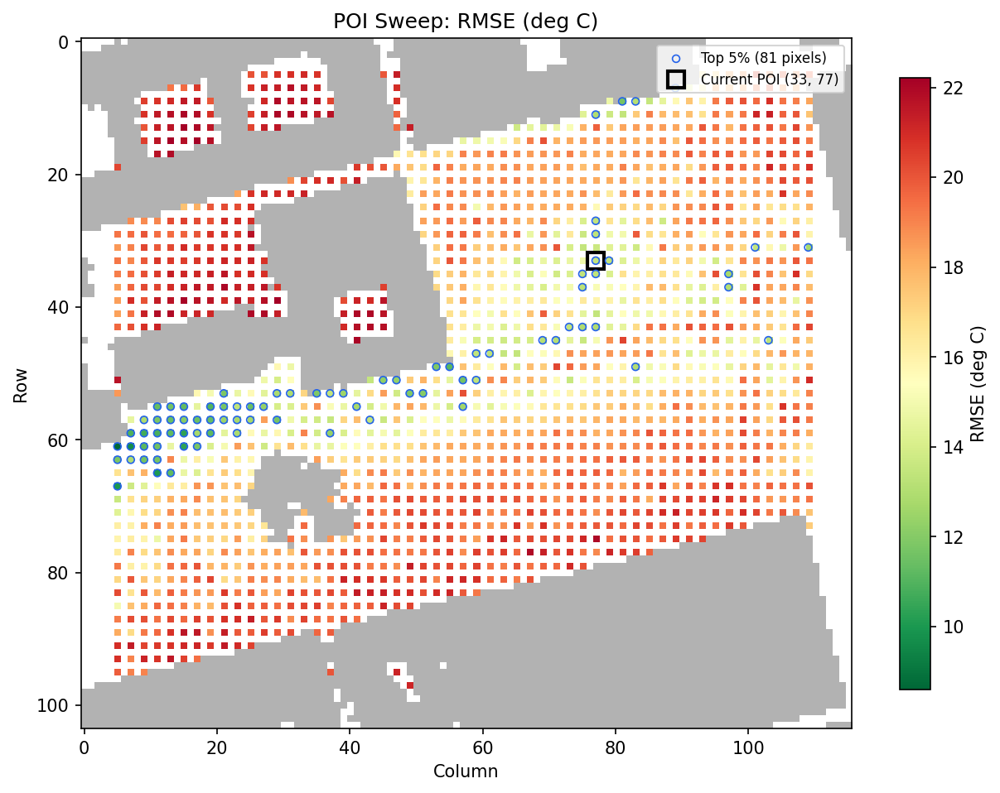
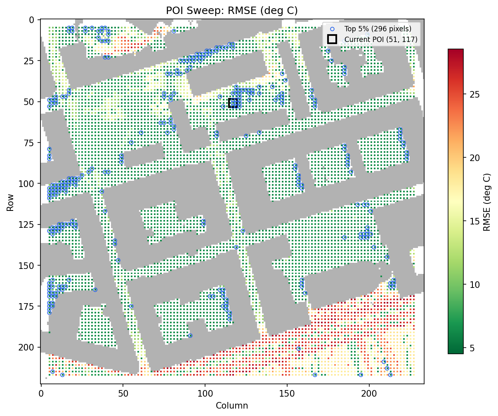
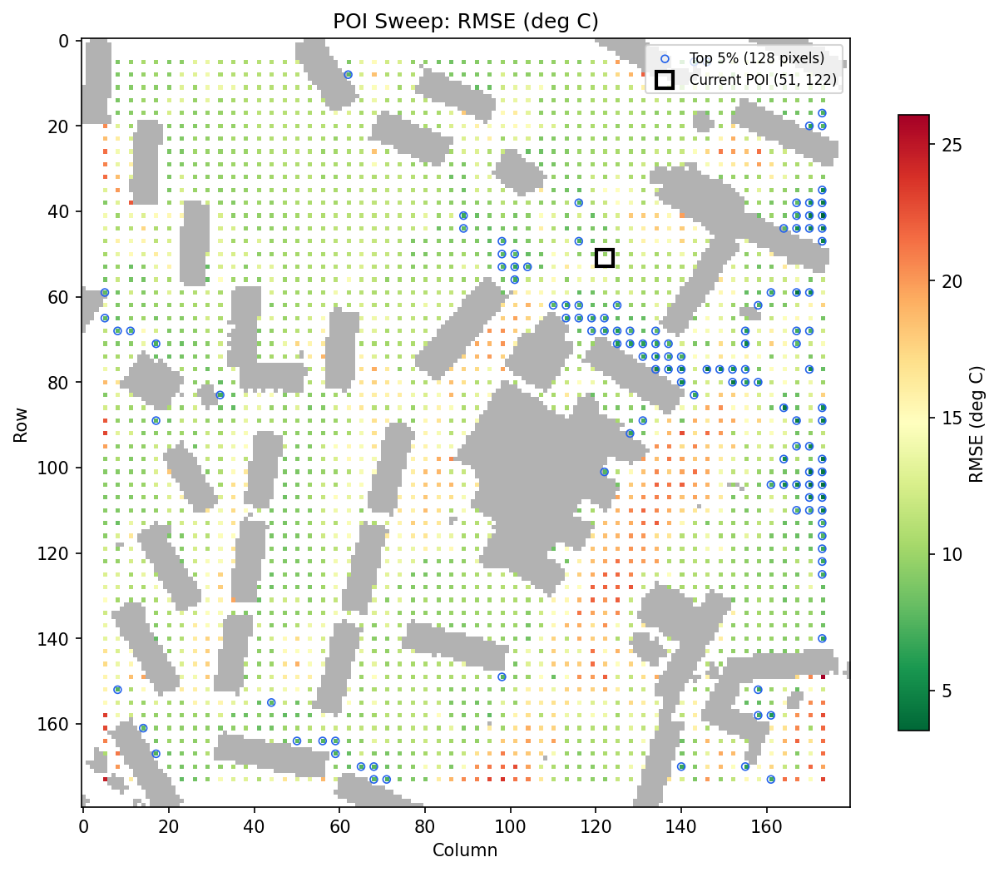

# Validation Report

SOLWEIG is validated against field radiation measurements from three sites in
Gothenburg, Sweden. All validation data — geodata, met files, measurement CSVs,
and POI coordinates (as GeoJSON) — are self-contained under `tests/validation/`
and run automatically in CI on every push and PR.

Each site's POI (point of interest) is loaded at runtime from a `poi.geojson`
file and projected onto the DSM grid. The GeoJSON coordinates were extracted
from the original shapefiles provided with each validation dataset.

---

## Sites

### Kronenhuset

- **Type:** Enclosed courtyard, central Gothenburg
- **Period:** 2005-10-07 (1 day, 12 daytime hours)
- **Resolution:** 1 m, EPSG:3007
- **POI:** (51, 117) — from `POI_KR.shp` measurement station coordinates
- **Reference:** Lindberg, Holmer & Thorsson (2008)
- **Data:** `tests/validation/kronenhuset/` (DSM, DEM, CDSM, landcover, met, poi.geojson)
- **Notes:** The only site that directly validates individual radiation budget
  components (K↓, K↑, L↓, L↑ and directional fluxes), not just Tmrt.
  Enclosed geometry with ~25% sky obstruction.

### Gustav Adolfs torg

- **Type:** Open square, central Gothenburg
- **Period:** 2005-10-11, 2006-07-26, 2006-08-01 (3 days, 43 daytime hours)
- **Resolution:** 2 m, EPSG:3006
- **POI:** (33, 77) — from `test_POI.shp` measurement station coordinates
- **Reference:** Lindberg, Holmer & Thorsson (2008)
- **Data:** `tests/validation/gustav_adolfs/` (DSM, DEM, CDSM, landcover, met, poi.geojson)
- **Notes:** One autumn day (heavily overcast) and two summer days.

### GVC (Gothenburg Geoscience Centre)

- **Type:** University campus courtyard, Gothenburg
- **Period:** 2010-07-07, 07-10, 07-12 (3 days, 30 daytime hours)
- **Resolution:** 2 m, EPSG:3006
- **POI:** (51, 122) — from `POI_GVC.shp` Site 1 measurement station coordinates
- **Reference:** Lindberg & Grimmond (2011)
- **Data:** `tests/validation/gvc/` (DSM, DEM, CDSM, landcover, met, poi.geojson)
- **Notes:** Three clear summer days. The POI corresponds to Site 1 from the
  paper. Rasters are labelled `_1m` but are actually 2 m resolution.

---

## Results — v0.1.0b66 (2026-03-09)

### Summary

| Metric               | Kronenhuset |  Gustav Adolfs |             GVC |
| -------------------- | ----------: | -------------: | --------------: |
| Tmrt RMSE range (°C) |         6.0 |      9.3–18.9  |    11.5–15.6    |
| Tmrt R² range        |        0.52 |     0.72–0.91  |   0.00–0.20     |
| Tmrt bias range (°C) |       +1.3  | -13.9 to -3.9  | -6.4 to +6.9    |
| Days                 |           1 |              3 |               3 |
| Total obs hours      |          12 |             43 |              30 |

### Tmrt — per-day detail

Anisotropic sky mode. Matched daytime hours only (sun above horizon with
valid observations).

| Site          | Day        | RMSE (°C) | MAE (°C) | Bias (°C) |   R² |   n |
| ------------- | ---------- | --------: | -------: | --------: | ---: | --: |
| Kronenhuset   | 2005-10-07 |       6.0 |      4.7 |      +1.3 | 0.52 |  12 |
| Gustav Adolfs | 2005-10-11 |      18.9 |     16.1 |     -13.9 | 0.91 |  12 |
| Gustav Adolfs | 2006-07-26 |      11.9 |      7.9 |      -4.6 | 0.56 |  16 |
| Gustav Adolfs | 2006-08-01 |       9.3 |      6.7 |      -3.9 | 0.72 |  15 |
| GVC           | 2010-07-07 |      15.6 |     11.4 |      -6.4 | 0.06 |  11 |
| GVC           | 2010-07-10 |      11.5 |      7.2 |      +6.9 | 0.00 |   7 |
| GVC           | 2010-07-12 |      13.2 |     10.3 |      -3.1 | 0.20 |  12 |

### Radiation components — all sites

All values anisotropic sky mode (isotropic in parentheses where notably
different). Units: W/m² for radiation, °C for Tmrt.

#### Kronenhuset (2005-10-07)

| Component |        RMSE |           Bias |
| --------- | ----------: | -------------: |
| K↓        | 51.0 (47.1) | -22.3 (-10.9)  |
| K↑        |         6.6 |           +3.5 |
| L↓        | 39.0 (45.4) | +38.5 (+45.2)  |
| L↑        |        13.1 |           +9.0 |
| Tmrt      |   6.0 (6.4) |   +1.3 (+2.7)  |

#### Gustav Adolfs torg

| Day        | Component |    RMSE |    Bias |
| ---------- | --------- | ------: | ------: |
| 2005-10-11 | K↓        |   221.7 |  -173.6 |
| 2005-10-11 | K↑        |    30.0 |   -23.4 |
| 2005-10-11 | L↓        |    83.7 |   +83.1 |
| 2005-10-11 | L↑        |    13.5 |    -6.7 |
| 2006-07-26 | K↓        |   182.4 |   -85.8 |
| 2006-07-26 | K↑        |    30.1 |   -18.3 |
| 2006-07-26 | L↓        |    76.4 |   +68.5 |
| 2006-07-26 | L↑        |    43.3 |   -29.2 |
| 2006-08-01 | K↓        |   178.2 |   -96.5 |
| 2006-08-01 | K↑        |    26.2 |   -14.1 |
| 2006-08-01 | L↓        |    65.2 |   +62.4 |
| 2006-08-01 | L↑        |    30.4 |   -13.7 |

#### GVC (2010-07-07, 07-10, 07-12)

| Day        | Component |    RMSE |    Bias |
| ---------- | --------- | ------: | ------: |
| 2010-07-07 | K↓        |   343.5 |  -146.6 |
| 2010-07-07 | K↑        |    32.6 |   -10.8 |
| 2010-07-07 | L↓        |    48.3 |   +46.6 |
| 2010-07-07 | L↑        |    36.3 |   -26.6 |
| 2010-07-10 | K↓        |   238.0 |   +97.8 |
| 2010-07-10 | K↑        |    18.2 |   +14.1 |
| 2010-07-10 | L↓        |    66.9 |   +66.7 |
| 2010-07-10 | L↑        |    21.8 |   +19.1 |
| 2010-07-12 | K↓        |   274.0 |  -101.9 |
| 2010-07-12 | K↑        |    22.9 |    -4.6 |
| 2010-07-12 | L↓        |    52.7 |   +52.1 |
| 2010-07-12 | L↑        |    20.6 |    -2.2 |

### Ldown — all sites

| Site          | Day        | RMSE (W/m²) | Bias (W/m²) |
| ------------- | ---------- | ----------: | ----------: |
| Kronenhuset   | 2005-10-07 |        39.0 |       +38.5 |
| Gustav Adolfs | 2005-10-11 |        83.7 |       +83.1 |
| Gustav Adolfs | 2006-07-26 |        76.4 |       +68.5 |
| Gustav Adolfs | 2006-08-01 |        65.2 |       +62.4 |
| GVC           | 2010-07-07 |        48.3 |       +46.6 |
| GVC           | 2010-07-10 |        66.9 |       +66.7 |
| GVC           | 2010-07-12 |        52.7 |       +52.1 |

---

## POI sweep analysis

The POI sweep runs the full SOLWEIG pipeline once per site, then evaluates
the modelled Tmrt time series at every ground-level pixel against the same
single set of field observations. The resulting RMSE/R²/bias heatmaps show
how sensitive the validation statistics are to the assumed measurement
location — they do not represent spatial maps of model error. A pixel with
low RMSE means that, had the instrument been placed there, the modelled and
observed Tmrt would have agreed more closely.

Run with: `pytest tests/validation/test_poi_sweep_all_sites.py -v -s`

### Gustav Adolfs torg sweep



The measurement station POI (33, 77) sits in the open square. Pixels near
the western buildings show lower RMSE (~8 °C vs ~13 °C), where shadow
patterns are more uniform. The open-square location is the documented
measurement position.

### Kronenhuset sweep



The measurement station POI (51, 117) is in the courtyard, consistent with
the described field setup (Tmrt RMSE ~6 °C).

### GVC sweep



The measurement station POI (51, 122) corresponds to Site 1 from
Lindberg & Grimmond (2011). This pixel sits at the edge of a dense tree
canopy in the CDSM (heights of 7–18 m immediately to the west and south),
making the modelled shadow state sensitive to sub-pixel canopy position.
Nearby pixels in more open areas show lower RMSE (~4–5 °C).

---

## Known limitations

### Kdown at open sites

Point-level downwelling shortwave (Kdown) has high RMSE (175–344 W/m²).
At any single pixel the shadow state is binary, so a small shift in the
modelled shadow boundary produces ~800 W/m² differences between timesteps.
Spatially averaged Kdown would show considerably lower error.

### Ldown overestimation

The model overestimates Ldown at all sites (bias +39 to +83 W/m²). The
SOLWEIG Ldown formulation (Jonsson et al. 2006) fills the non-sky hemisphere
with wall emissions at emissivity 0.90 and air temperature. In practice,
shaded walls are cooler than air temperature, which introduces a positive bias.

- At SVF = 1.0 (open sky), clear-sky Ldown matches observations well.
- The bias increases at sites with lower SVF, where more of the hemisphere
  is filled with wall emissions.
- The Jonsson et al. (2006) empirical correction of −25 W/m² is present but
  commented out in all UMEP releases (2021a, 2022a, 2025a) and is not applied
  here.

### GVC Tmrt accuracy

The GVC site shows higher Tmrt RMSE (11–16 °C) and near-zero R² compared to
the other two sites. Contributing factors include:

- The measurement station (Site 1) is adjacent to dense tree canopy in the
  CDSM, making the modelled shadow state sensitive to sub-pixel canopy
  position at 2 m resolution.
- Only 7–12 matched hours per day are available, which limits the statistical
  power of per-day metrics such as R².

---

## Comparison with published results

Lindberg et al. (2008) report aggregate statistics over 7 days at two
Gothenburg sites (~189 hours):

| Component |   R² |      RMSE |
| --------- | ---: | --------: |
| Tmrt      | 0.94 |     4.8 K |
| L↓        | 0.73 | 17.5 W/m² |
| L↑        | 0.94 | 15.6 W/m² |

The Kronenhuset Tmrt RMSE of 6.0 °C from this implementation is in a similar
range to the paper's 4.8 K. The paper's statistics are aggregated across more
hours and sites, and the paper validates against 1-minute averaged measurements,
whereas the met data used here are hourly.

---

## Running validation tests

```bash
# All validation tests (fast data-loading + slow pipeline)
pytest tests/validation/ -m validation

# Just the fast data-loading checks
pytest tests/validation/ -m "validation and not slow"

# A single site
pytest tests/validation/test_validation_gvc.py -v -s

# POI sensitivity sweep (all sites, generates PNG heatmaps)
pytest tests/validation/test_poi_sweep_all_sites.py -v -s
```

---

## Version history

| Version | Date | Sites | Tmrt RMSE range | Key changes |
| --- | --- | ---: | ---: | --- |
| 0.1.0b57 | 2026-03-05 | 3 | 3.4–17.7 °C | Initial 3-site validation. POI sweep analysis added for all sites. Ldown wall-temperature bias documented. |
| 0.1.0b58 | 2026-03-06 | 3 | 3.4–17.7 °C | Add validation CI job. Remove non-reproducible Kolumbus/Montpellier tests. Clarify POI sweep documentation. |
| 0.1.0b59 | 2026-03-06 | 3 | 4.0–17.7 °C | Move GVC POI to courtyard cluster (70, 126). Shift Kronenhuset POI +1 col to match shadow profile. Move validation report to repo root. |
| 0.1.0b60 | 2026-03-06 | 3 | 4.0–17.7 °C | GPU GVF compute shader (wgpu). Cached thermal accumulation offloaded to GPU with automatic CPU fallback. |
| 0.1.0b61 | 2026-03-08 | 3 | 2.4–18.9 °C | Fix file-mode prepare() order (preprocess before walls/SVF), fix tiled wall propagation, fix single-Weather API, fix ModelConfig.from_json() materials, fix QGIS LC override inheritance, fix EPW cross-year timestamps. Ldown RMSE increased due to corrected SVF geometry (absolute heights). |
| 0.1.0b62 | 2026-03-08 | 3 | 2.4–18.9 °C | 35 code review fixes: clearness index, UTC offsets, cache validation, input mutation, dead code, orchestration dedup, lazy imports, PET convergence warning, GPU mutex recovery. |
| 0.1.0b66 | 2026-03-09 | 3 | 6.0–18.9 °C | Use original measurement station POIs from shapefiles (saved as GeoJSON). GVC POI corrected from (70,126) to (51,122) per POI_GVC.shp. KR rasters moved to self-contained validation folder. All POIs loaded at runtime from poi.geojson via conftest helper. |

---

## References

1. Lindberg, F., Holmer, B. & Thorsson, S. (2008). SOLWEIG 1.0 — Modelling
   spatial variations of 3D radiant fluxes and mean radiant temperature in
   complex urban settings. _Int. J. Biometeorol._ 52, 697–713.

2. Lindberg, F. & Grimmond, C.S.B. (2011). The influence of vegetation and
   building morphology on shadow patterns and mean radiant temperature in
   urban areas. _Theor. Appl. Climatol._ 105, 311–323.

3. Jonsson, P., Eliasson, I., Holmer, B. & Grimmond, C.S.B. (2006). Longwave
   incoming radiation in the Tropics: results from field work in three African
   cities. _Theor. Appl. Climatol._ 85, 185–201.
