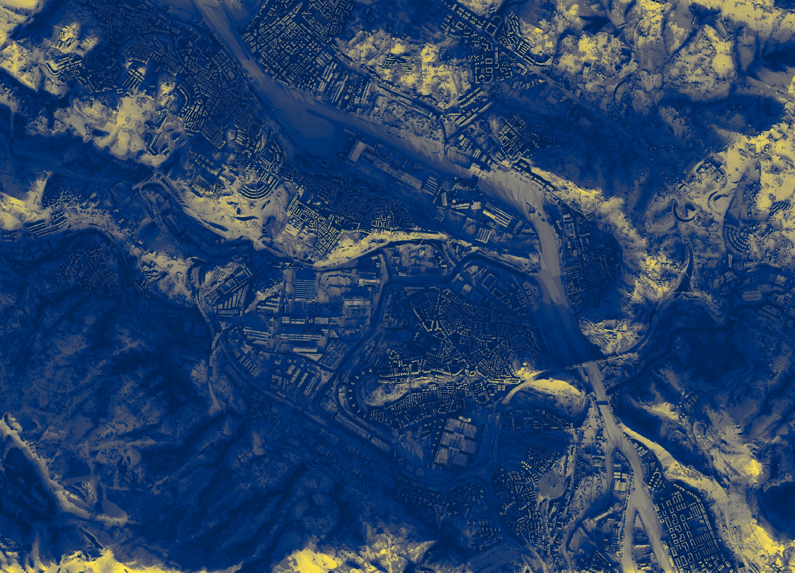

# SOLWEIG

**Spatially resolved mean radiant temperature and thermal comfort modelling for urban environments.**

!!! warning "Experimental"
    This package and QGIS plugin are released for testing and discussion purposes. The API is stabilising but may change. Feedback and bug reports are welcome — [open an issue](https://github.com/UMEP-dev/solweig/issues).

SOLWEIG computes **Mean Radiant Temperature (Tmrt)** and thermal comfort indices (**UTCI**, **PET**) for urban environments. Given a building height model and weather data, it produces high-resolution maps of the radiation environment experienced by a person at ground level.

!!! info "Attribution"
    This package is adapted from the [UMEP](https://github.com/UMEP-dev/UMEP-processing) (Urban Multi-scale Environmental Predictor) platform by Fredrik Lindberg, Sue Grimmond, and contributors. If you use SOLWEIG in your research, please [cite the original papers](#citation).


*DSM/DEM data: [PNOA-LiDAR](https://pnoa.ign.es/pnoa-lidar), Instituto Geográfico Nacional (IGN), Spain. CC BY 4.0.*

## Intended Users

- **Urban planners** comparing street designs, tree planting, or cool-roof strategies
- **Researchers** conducting microclimate experiments at 1 m resolution
- **Climate service providers** generating heat-risk maps for public health or events
- **Students** studying urban radiation and thermal comfort

## Minimal Example

```python
import solweig

# Load building heights and weather data
surface = solweig.SurfaceData.prepare(dsm="dsm.tif", working_dir="cache/")
weather_list = solweig.Weather.from_epw("weather.epw", start="2025-07-01", end="2025-07-03")
location = solweig.Location.from_epw("weather.epw")

# Run calculation — results saved as GeoTIFFs
solweig.calculate(
    surface=surface,
    weather=weather_list,
    location=location,
    output_dir="output/",
)
```

`SurfaceData.prepare()` performs all preprocessing (walls, SVF, shadow matrices); `calculate()` uses these to compute shadows, radiation, and Tmrt. The anisotropic sky model is enabled by default.

## Model Overview

SOLWEIG models the complete radiation budget experienced by a person standing outdoors:

1. **Shadows** — Determination of shaded pixels from buildings and trees
2. **Sky View Factor** — Fraction of open sky visible from each point
3. **Surface temperatures** — Ground and wall temperature estimation
4. **Radiation balance** — Summation of shortwave (solar) and longwave (thermal) fluxes from all directions
5. **Tmrt** — Conversion of absorbed radiation into mean radiant temperature
6. **Thermal comfort** — Optional derivation of UTCI or PET indices

!!! note "SVF Rule"
    `SurfaceData.prepare()` computes SVF as part of surface preparation. SVF data must exist before calling `calculate()`.

!!! note "Anisotropic Rule"
    The anisotropic sky model is enabled by default (`use_anisotropic_sky=True`). It requires the SVF and shadow matrices produced by `prepare()`.

## Documentation

<div class="grid cards" markdown>

-   :material-rocket-launch:{ .lg .middle } **Getting Started**

    ---

    Install SOLWEIG and run an initial calculation

    [:octicons-arrow-right-24: Installation](getting-started/installation.md)
    [:octicons-arrow-right-24: Quick Start](getting-started/quick-start.md)

-   :material-school:{ .lg .middle } **Tutorials**

    ---

    Step-by-step notebooks with Athens data and visual outputs

    [:octicons-arrow-right-24: Athens Quick Start](tutorials/01-athens-quickstart.ipynb)
    [:octicons-arrow-right-24: Timeseries Analysis](tutorials/02-timeseries-analysis.ipynb)
    [:octicons-arrow-right-24: Thermal Comfort](tutorials/03-thermal-comfort.ipynb)

-   :material-book-open-variant:{ .lg .middle } **User Guide**

    ---

    Common workflows: loading GeoTIFFs, timeseries, thermal comfort

    [:octicons-arrow-right-24: Basic Usage](guide/basic-usage.md)
    [:octicons-arrow-right-24: Working with GeoTIFFs](guide/geotiffs.md)
    [:octicons-arrow-right-24: Timeseries](guide/timeseries.md)
    [:octicons-arrow-right-24: Thermal Comfort](guide/thermal-comfort.md)

-   :material-api:{ .lg .middle } **API Reference**

    ---

    Complete reference for all classes and functions

    [:octicons-arrow-right-24: API Reference](api/index.md)

-   :material-flask:{ .lg .middle } **Physics**

    ---

    Scientific documentation of the radiation model

    [:octicons-arrow-right-24: Physics](physics/index.md)

-   :material-map:{ .lg .middle } **QGIS Plugin**

    ---

    Spatial analysis in QGIS without scripting

    [:octicons-arrow-right-24: QGIS Plugin](guide/qgis-plugin.md)

</div>

## Citation

If you use SOLWEIG in your research, please cite the original model paper and the UMEP platform:

1. Lindberg F, Holmer B, Thorsson S (2008) SOLWEIG 1.0 – Modelling spatial variations of 3D radiant fluxes and mean radiant temperature in complex urban settings. *International Journal of Biometeorology* 52, 697–713 [doi:10.1007/s00484-008-0162-7](https://doi.org/10.1007/s00484-008-0162-7)

2. Lindberg F, Grimmond CSB, Gabey A, Huang B, Kent CW, Sun T, Theeuwes N, Järvi L, Ward H, Capel-Timms I, Chang YY, Jonsson P, Krave N, Liu D, Meyer D, Olofson F, Tan JG, Wästberg D, Xue L, Zhang Z (2018) Urban Multi-scale Environmental Predictor (UMEP) – An integrated tool for city-based climate services. *Environmental Modelling and Software* 99, 70-87 [doi:10.1016/j.envsoft.2017.09.020](https://doi.org/10.1016/j.envsoft.2017.09.020)

## License

GNU Affero General Public License v3.0. See [LICENSE](https://github.com/UMEP-dev/solweig/blob/main/LICENSE) for details.
