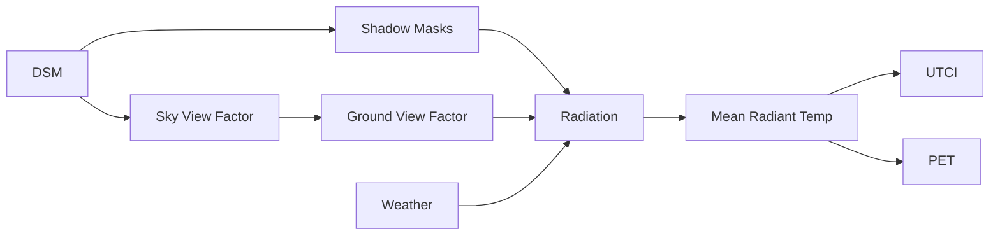

# Physics Overview

SOLWEIG (Solar and Longwave Environmental Irradiance Geometry) calculates the mean radiant temperature (Tmrt) by modeling the complete radiation budget at a point in an urban environment.

## Radiation Budget

The total radiation received by a human body is:

$$
R_{total} = R_{short} + R_{long}
$$

Where:

- **Shortwave** ($R_{short}$): Direct and diffuse solar radiation
- **Longwave** ($R_{long}$): Thermal radiation from sky, ground, and walls

## Calculation Pipeline

## Component Models

Detailed specifications for each component are maintained in the [`specs/`](https://github.com/UMEP-dev/solweig/tree/main/specs) directory.

### 1. Sky View Factor (SVF)

Fraction of sky visible from each point, accounting for buildings and vegetation.

[:octicons-arrow-right-24: SVF Specification](https://github.com/UMEP-dev/solweig/blob/main/specs/svf.md){target=_blank}

### 2. Shadow Calculation

Sun position and ray tracing to determine shadow patterns.

[:octicons-arrow-right-24: Shadow Specification](https://github.com/UMEP-dev/solweig/blob/main/specs/shadows.md){target=_blank}

### 3. Ground View Factor (GVF)

View factor from point to ground surface, computing thermal emission from surrounding ground and walls.

[:octicons-arrow-right-24: GVF Specification](https://github.com/UMEP-dev/solweig/blob/main/specs/gvf.md){target=_blank}

### 4. Radiation Model

Complete shortwave and longwave radiation budget.

[:octicons-arrow-right-24: Radiation Specification](https://github.com/UMEP-dev/solweig/blob/main/specs/radiation.md){target=_blank}

### 5. Ground Temperature

Surface temperature model with thermal inertia.

[:octicons-arrow-right-24: Ground Temperature Specification](https://github.com/UMEP-dev/solweig/blob/main/specs/ground_temperature.md){target=_blank}

### 6. Mean Radiant Temperature

Integration of all radiation fluxes into Tmrt.

[:octicons-arrow-right-24: Tmrt Specification](https://github.com/UMEP-dev/solweig/blob/main/specs/tmrt.md){target=_blank}

## Thermal Comfort Indices

### UTCI (Universal Thermal Climate Index)

Fast polynomial approximation for outdoor thermal comfort.

[:octicons-arrow-right-24: UTCI Specification](https://github.com/UMEP-dev/solweig/blob/main/specs/utci.md){target=_blank}

### PET (Physiological Equivalent Temperature)

Iterative solver based on human energy balance.

[:octicons-arrow-right-24: PET Specification](https://github.com/UMEP-dev/solweig/blob/main/specs/pet.md){target=_blank}

## References

1. Lindberg F, Holmer B, Thorsson S (2008) SOLWEIG 1.0 – Modelling spatial variations of 3D radiant fluxes and mean radiant temperature in complex urban settings. *Int J Biometeorol* 52:697-713 [doi:10.1007/s00484-008-0162-7](https://doi.org/10.1007/s00484-008-0162-7)

2. Lindberg F, Grimmond CSB (2011) The influence of vegetation and building morphology on shadow patterns and mean radiant temperatures in urban areas: model development and evaluation. *Theor Appl Climatol* 105:311-323

3. Lindberg F, Onomura S, Grimmond CSB (2016) Influence of ground surface characteristics on the mean radiant temperature in urban areas. *Int J Biometeorol* 60:1439-1452

4. Lindberg F, Grimmond CSB, Martilli A (2015) Sunlit fractions on urban facets – Impact of spatial resolution and approach. *Urban Climate* 12:65-84

5. Konarska J, Lindberg F, Larsson A, Thorsson S, Holmer B (2014) Transmissivity of solar radiation through crowns of single urban trees — application for outdoor thermal comfort modelling. *Theor Appl Climatol* 117:363-376

6. Lindberg F, Grimmond CSB, Gabey A, et al. (2018) Urban Multi-scale Environmental Predictor (UMEP) – An integrated tool for city-based climate services. *Environ Model Softw* 99:70-87 [doi:10.1016/j.envsoft.2017.09.020](https://doi.org/10.1016/j.envsoft.2017.09.020)
